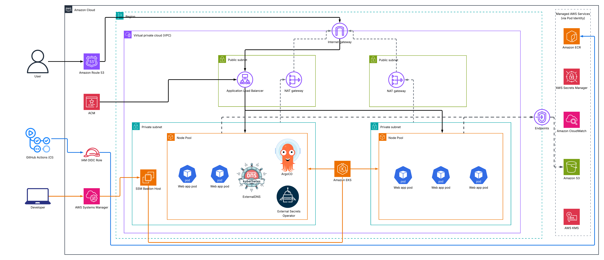

# Enterprise-Grade AWS EKS Infrastructure Platform

[](https://www.terraform.io/)
[](https://kubernetes.io/)
[](https://aws.amazon.com/eks/)
[](https://argoproj.github.io/cd/)
[](https://aws.amazon.com/)

An enterprise-ready, fully private Amazon EKS deployment engineered with **EKS Auto Mode**, **Zero-Inbound Bastion access via AWS SSM**, **GitOps delivery (ArgoCD)**, **EKS Pod Identity**, and **automated persistent storage provisioning (AWS EBS CSI Driver)**.

This infrastructure is built entirely via Infrastructure as Code (Terraform) to back the production microservices application in [MovinVinusandha/google-microservices-demo](https://github.com/MovinVinusandha/google-microservices-demo).

---

## Architecture Diagram



---

## Key Infrastructure Components

| Component | Technology | Purpose |
| :--- | :--- | :--- |
| **VPC & Networking** | AWS VPC (3 AZs, 3 NAT Gateways) | Fully private subnets with strict egress control |
| **Compute Plane** | EKS Auto Mode on Kubernetes 1.36 | Dual NodePools (`general-purpose` and dedicated `system`) with automated scaling and patching |
| **Control Plane Security** | AWS KMS CMK Encryption | Envelope encryption for all Kubernetes Secrets |
| **Identity & IAM** | AWS EKS Pod Identity | Modern credential injection for ExternalDNS, CloudWatch & EBS CSI |
| **Persistent Storage** | AWS EBS CSI Driver Addon | Dynamic provisioning of gp3 EBS volumes for stateful workloads |
| **DNS & Ingress** | Route 53 + AWS ACM Wildcard | Automated DNS records via ExternalDNS and SSL termination |
| **Pod Stability Controls** | Karpenter Disruption Annotations & PDBs | Prevents node consolidation evictions (`karpenter.sh/do-not-disrupt`) and enforces PodDisruptionBudgets |

---

## ⚡ Deployment Instructions

### 1. Configure and Deploy Infrastructure
1. Customize **`terraform.tfvars`** with your domain name and settings.
2. Initialize and deploy:
   ```bash
   terraform init

   # Step 1: Create Route 53 zone first
   terraform apply -target=aws_route53_zone.primary

   # Step 2: Retrieve your 4 AWS Name Servers and update your registrar
   terraform output route53_name_servers

   # Step 3: Deploy the complete infrastructure (including EBS CSI driver)
   terraform apply
   ```

### 2. Connect Securely (Zero Inbound Ports)

Connect using two terminal windows:

#### Terminal 1: Open the SSM Tunnel
```bash
eval "$(terraform output -raw connect_script)"
```
*Listens locally on `127.0.0.1:6443` via AWS Systems Manager Session Manager.*

#### Terminal 2: Configure kubectl
```bash
# 1. Fetch AWS cluster context
aws eks update-kubeconfig --region us-east-1 --name prod-eks-cluster

# 2. Point kubectl to local tunnel with TLS validation
CLUSTER_DOMAIN=$(terraform output -raw eks_api_server_domain)
CONTEXT=$(kubectl config current-context)

kubectl config set-cluster $CONTEXT \
  --server=https://127.0.0.1:6443 \
  --tls-server-name=$CLUSTER_DOMAIN

# 3. Verify connection
kubectl get nodes
```

---

## 🔗 Integrated Microservices Platform

Once the infrastructure is up, the workloads and platform stacks are deployed from the application repository:
👉 **[Microservices Application Repository & Deployment Guide](https://github.com/MovinVinusandha/google-microservices-demo)**
